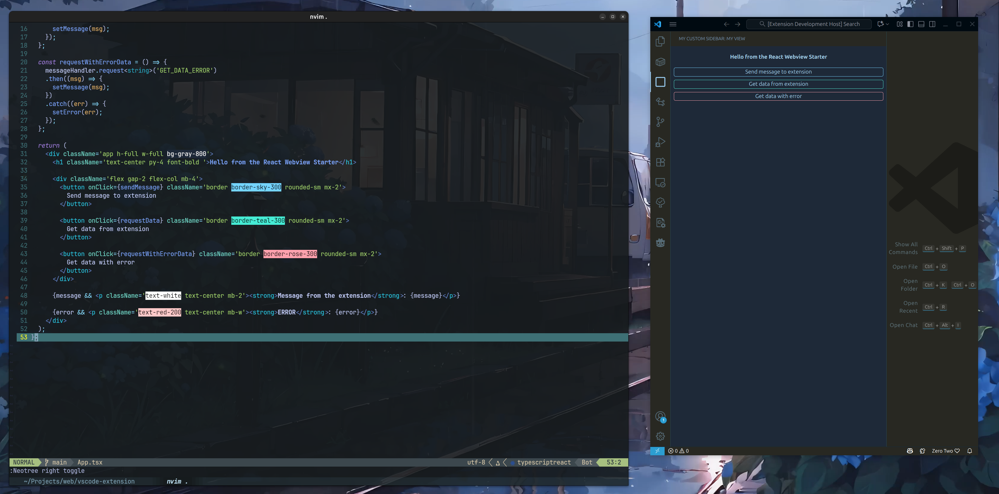

# Visual Studio Code Webview Extension - React + Tailwind
This is a starter template for creating a Visual Studio Code extension with a React webview.
Based on the template at https://github.com/estruyf/vscode-react-webview-template

<b>Key modifications:</b>
- Upgraded old packages
- Removed legacy `.eslintrc` and removed with flat config `eslint.config.mts`
- Added Tailwind CSS version 4
- Demonstrated embedding webview in the Primary Side Bar (Left Side Bar)

## Development

- Clone this repository
- Run `npm install` to install dependencies
- Open the project with `code -r .`
- Press `F5` to start the extension development host

## Openning the Extension
- Look for the following icon in the Acitivity Bar and click on it to show the webview
 
SVG taken from https://www.svgrepo.com/ 

